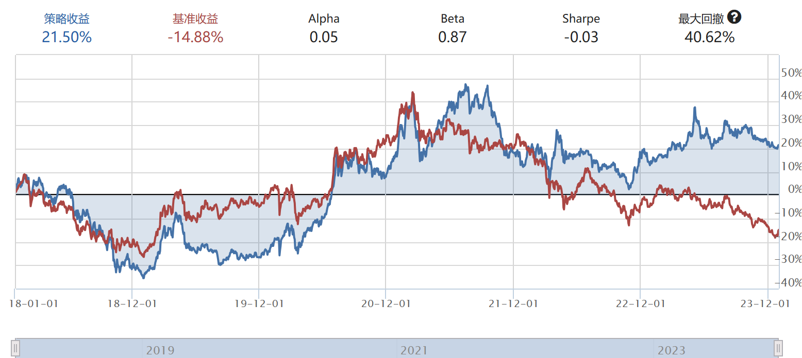

# 多因子自适应动态权重选股策略（JoinQuant）

本项目包含一个在聚宽（JoinQuant）上可直接运行的多因子选股策略，并实现了**IC-IR 动态权重自适应分配**、**市值与行业中性化处理**、以及**低换手缓冲机制**。策略在 2018–2023 期间对比沪深300基准取得了显著超额收益。

---

## 回测表现（2018-01 ~ 2023-12）

| 指标 | 策略 | 基准 |
|-----|-----|------|
| 累计收益 | **21.50%** | -14.88% |
| Alpha | 0.05 | - |
| Beta  | 0.87 | - |
| Sharpe | -0.03 | - |
| 最大回撤 | 40.62% | - |

> 蓝线为策略，红线为基准。策略主要在震荡区间中体现较强稳健性，经过换手抑制使得调仓路径平滑。

---

## 核心思想

本策略同时使用五类基本因子：

| 因子 | 含义 | 经济逻辑 |
|-----|------|---------|
| EP | 盈利收益率（1/PE）| 价值回归 |
| BP | 账面市值比（1/PB）| 资产重估 |
| ROE | 净资产收益率 | 质量提升 |
| GPM | 毛利率 | 产品竞争力与护城河 |
| MOM | 动量因子 | 趋势延续 |

### 中性化处理
为了避免行业与市值暴露干扰因子真实信号，策略进行了：

- **市值中性化**：对因子做 `因子 ~ 市值` 回归，取残差  
- **行业中性化**：对残差按申万一级行业去行业均值、再标准化  

### 动态权重：**IC-IR 自适应**
我们对因子在最近 12 个调仓周期的 Spearman IC 做滚动评估：

- IC-IR 越高 → 因子越有效 → 权重越大  
- 若某因子近期失效（IC < 0） → 权重自动衰减至 0  
- 若全部因子低效 → 回退为等权配置  

**优点：策略可随市场周期轮动自动调节因子侧重。**

### 换手抑制 & 缓冲带
为降低交易成本与噪声调仓：

- 每次只从得分前 `hold_buffer` 支中维持旧持仓
- 不足部分再从前 `target_n` 中补齐  
→ **稳定持仓结构、降低调仓噪声**

---

## 文件说明

| 文件 | 说明 |
|------|------|
| `01.py` | 主策略：IC-IR 动态因子权重 + 市值与行业中性化 + 调仓逻辑 :contentReference[oaicite:0]{index=0} |
| `01_explain.py` | 较简化的示例多因子策略，用于辅助理解因子构造与回测流程 :contentReference[oaicite:1]{index=1} |
| `image.png` | 回测净值曲线对比图 |

---

## 使用说明（JoinQuant / 聚宽）

1. 打开 https://www.joinquant.com
2. 新建研究环境或策略
3. 将 `01.py` 内容直接粘贴进去
4. 选择回测区间并运行即可

如需导出权重变化，可在策略日志中搜索：`WEIGHTS_CSV`

---

## 进一步优化方向

- 引入 Barra 风格中性化框架，提升风险可控性  
- 将动量因子分解为中短周期组合，增强趋势识别  
- 加入波动目标或回撤约束（如 CVaR / Kelly 上限)  

---

## 许可协议

本项目仅用于学术研究与策略展示，不构成任何投资建议。

